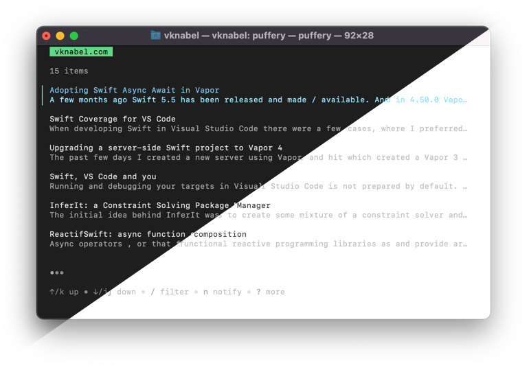

# Go Puffery 🐡

Read and send push notifications to your iOS device from your command line with [Puffery](https://github.com/vknabel/puffery).

If you want to build an app on top of Puffery, you can also use `github.com/vknabel/puffery-go` as a library.



In case you need inspiration or help, head over to [our GitHub discussions](https://github.com/vknabel/puffery/discussions)!

## Installation

The easiest way to install and update Puffery on macOS or linux is Homebrew.

```bash
$ brew install vknabel/install/puffery
```

If you are a gopher and want to install it globally, just run `go install github.com/vknabel/go-puffery@latest`.
In case you plan to write custom tooling on top of Puffery, you can start by running `go get github.com/vknabel/go-puffery@latest` in your Go module.

In case you are neither using Homebrew nor Go modules, head over to the [GitHub releases page](https://github.com/vknabel/go-puffery/releases) and download the latest version, that fits your operating system and architecture.

## Current Status

Currently go puffery is still in early development and doesn't yet support all features of the Puffery iOS App.

- [x] Logging in and out
- [x] Displaying all channels
- [x] Displaying all messages
- [x] Sending push notifications
- [ ] Sending push notifications with colors
- [ ] Creating and subscribing to channels
- [ ] Displaying stats of a channel

## Embedding puffery in your app

The main puffery module exports the whole API and all of its models.
Start by creating a new Api

```go
import (
    puffery "github.com/vknabel/go-puffery"
)

var pufferyApi = puffery.New()

err := pufferyApi.Hello()
if err != nil {
    panic(err)
}
```

Most endpoints require setting the token - either by confirming a login challenge `(*Api) ConfirmLogin` or by registering a new user `(*Api) Register`.

If you want to handle the session yourself, feel free to call `(*Api) SetToken` manually.

# License

go-puffery is licensed under the [MIT license](./LICENSE).
